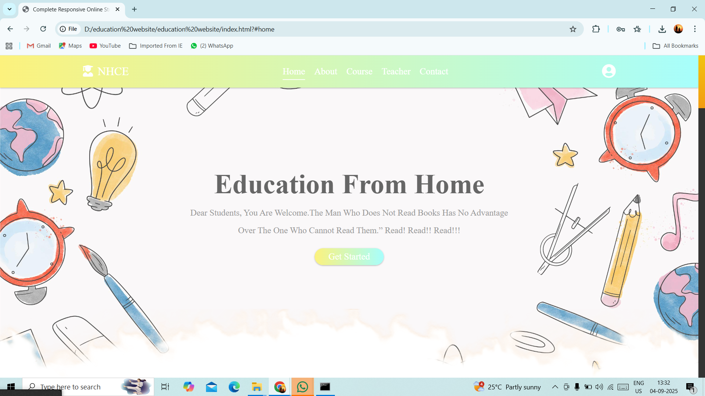
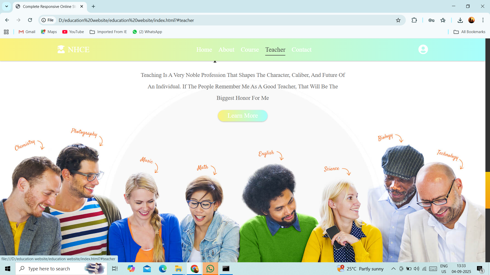

# 📚 Education Website  

A fully responsive, modern education website built using **HTML, CSS, and JavaScript**.  
This project is designed to provide a clean, user-friendly interface for online learning platforms, with responsive design for desktop and mobile devices.

---

## 🚀 Features  
✅ **Responsive Design** – Works seamlessly on desktops, tablets, and mobiles  
✅ **Attractive UI** – Clean, modern layout with smooth animations  
✅ **Courses Section** – Displays available courses with images  
✅ **About & Contact Pages** – Provides detailed information and contact options  
✅ **Reusable Components** – Well-structured HTML, CSS, and JS files  

---

## 🛠️ Tech Stack  
- **HTML5** – Structure  
- **CSS3** – Styling (Responsive Layouts, Animations)  
- **JavaScript (Vanilla)** – Interactivity  

---

## 📂 Project Structure  
```bash
education-website/
│
├── index.html              # Main landing page
├── css/
│   └── style.css           # Stylesheet
├── js/
│   └── script.js           # Scripts for interactivity
└── images/                 # All images used in the project
```

---

## 📦 Installation & Setup  

1. **Clone this repository**
```bash
git clone https://github.com/<your-username>/education-website.git
```

2. **Navigate into the project folder**
```bash
cd education-website
```

3. **Open in browser**  
Simply open `index.html` in your browser.

---

## 🌐 Deploy on GitHub Pages  

1. Push this project to a GitHub repository.  
2. Go to **Settings > Pages** on your repo.  
3. Under **Build and deployment**, select:
   - Source: `Deploy from a branch`
   - Branch: `main` (or `master`) and `/ (root)` folder  
4. Click **Save**.  
5. Your site will be live at:  
   `https://<your-username>.github.io/education-website/`

---

## 🎯 Usage  
- Customize `index.html`, `style.css`, and `script.js` as needed.  
- Replace images inside `/images` to personalize the website.  
- Easily share the deployed link in your resume or LinkedIn.

---

## 📸 Screenshots 
## 📸 Project Screenshots

### 🏠 Home


### ℹ️ About Us


### 📚 Courses


### 📞 Contact Us


### 🔑 Login & Register


### 👩‍🏫 Teachers



## 🤝 Contributing  
Contributions are welcome! Feel free to open issues or submit pull requests.

---

## 📜 License  
This project is open source and available under the [MIT License](LICENSE).
